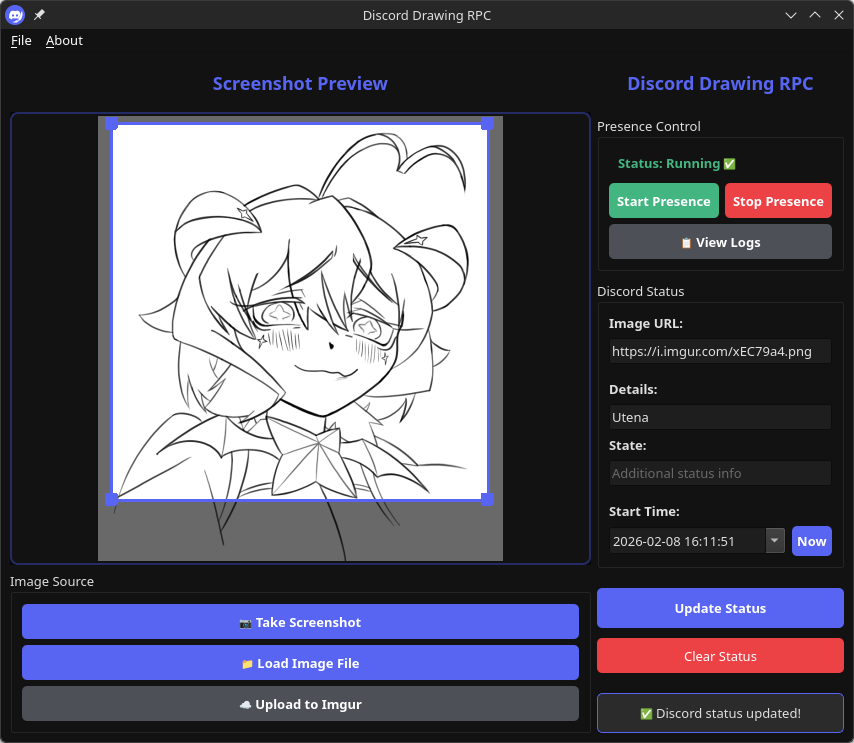
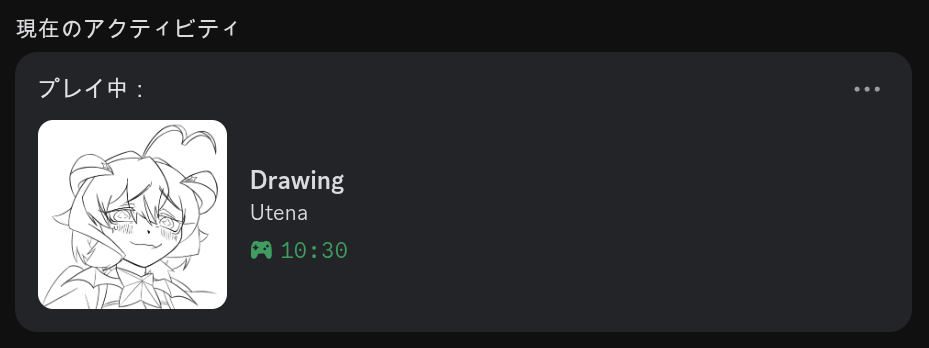

<h2 align="center">
  
   
  Discord Drawing RPC
</h2>

A native desktop application that lets you share your drawing progress with Discord friends through Rich Presence.

## What is it?

Discord Draw RPC allows you to update your friends with a preview of your drawings directly in your Discord status. Whether you're working on digital art, sketches, or any creative work, your friends can see what you're creating in real-time.

## Key Features

- **Lightweight native application** – This app is lightweight (not a web app lmao)
- **System tray integration** – Runs quietly in the background
- **Cross-platform support** – Works on Windows and other platforms

## Screenshots

  
  
<i>Main application window</i>

  
  
  
<i>Discord Rich Presence activity display</i>

## Getting Started

See [BUILD.md](BUILD.md) for build and installation instructions.

## Components

- **GUI** – Main application interface for settings and screenshot selection
- **Daemon** – Background service that handles Discord RPC communication
- **Tray** – System tray icon for quick access and controls

